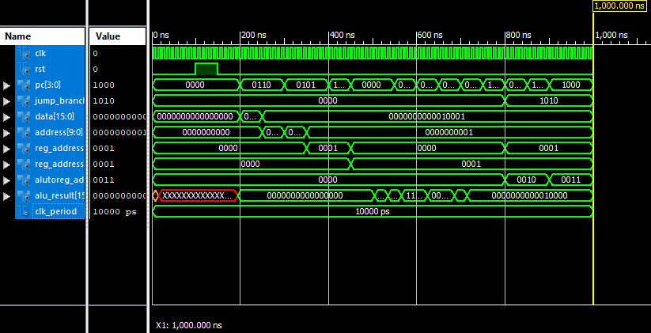

# 🧠 Simple CPU Implementation in VHDL

This project implements a simple CPU using VHDL as part of an academic course. It includes key components such as the ALU, Control Unit, Register File, and Memory, and demonstrates basic instruction execution and simulation in a modular design.

## ⚙️ Features

- Simple RISC-like architecture
- 16-bit data and address bus
- Supports basic operations: `ADD`, `SUB`, `AND`, `OR`, `LOAD`, `STORE`, etc.
- Register-based instruction execution
- Separate instruction and data memory
- Testbench included for verification and debugging

## 🧪 How to Run

You can simulate the design using any VHDL simulator such as:

- **ModelSim / QuestaSim**
- **GHDL**
- **Xilinx Vivado** (for synthesis and simulation)
- **Intel Quartus** (if targeting FPGA boards)

## 🧠 Learning Objectives
- Understand CPU design from the ground up
- Gain hands-on experience with hardware description languages
- Practice modular design and simulation techniques

## 📊 Simulation Waveform

Below is a sample waveform from the CPU testbench simulation:

## 📬 Contact Me

If you have any questions, feedback, or collaboration requests, feel free to reach out:

- **Name**: HamidRG 
- **Email**: [h.r.ghorbani82@gmail.com](mailto:h.r.ghorbani82@gmail.com)  
- **GitHub**: [github.com/hamidrg](https://github.com/hamidrg)  

---

> *Thank you for checking out this project!*
